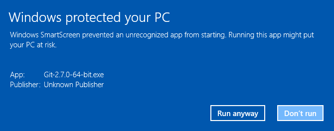

# Cloud Development Dojo

<!-- START doctoc generated TOC please keep comment here to allow auto update -->
<!-- DON'T EDIT THIS SECTION, INSTEAD RE-RUN doctoc TO UPDATE -->


- [Slides](#slides)
- [Golang](#golang)
  - [Installing Git](#installing-git)
    - [Installing Git on Windows](#installing-git-on-windows)
    - [Installing Git on OSX](#installing-git-on-osx)
    - [Installing Git on Linux / Debian-ish](#installing-git-on-linux--debian-ish)
  - [Install Go](#install-go)
    - [Setting up Go on Linux / OSX (macOS)](#setting-up-go-on-linux--osx-macos)
    - [Setting up Go on Windows](#setting-up-go-on-windows)
- [React](#react)
  - [Folder Structure](#folder-structure)
  - [Available Scripts](#available-scripts)
    - [`npm start`](#npm-start)
    - [`npm test`](#npm-test)
    - [`npm run build`](#npm-run-build)
  - [Installing a Dependency](#installing-a-dependency)

<!-- END doctoc generated TOC please keep comment here to allow auto update -->

## Slides

* Introduction to React: https://arekkas.github.io/slides-pti-react-electron/
* Introduction to Golang: https://arekkas.github.io/slides-pti-go-dojo/

## Golang

### Installing Git

Download git from [git-scm](https://git-scm.com/downloads).

#### Installing Git on Windows

Unfortunately, Microsoft *might* block the installation of Git. This is due to missing certificates, as most open source
projects do not have the resources to buy such an certificate from Microsoft. If you see an error like this one


there is no need to worry. Git has been around for years and is used by hundreds of thousands of developers every day
and is completely open source and peer reviewed. To override the faulty Windows SmartScreen, click on **More info**



and press **Run anyway**. Now, the installer should start.


There is no need for customization while installing and you can simply use the default settings
by pressing **Next >**. When the installer is done, you should see this:


#### Installing Git on OSX

Download git from [git-scm](https://git-scm.com/downloads).

Once you have downloaded the git installer, open the file with right-click -> open and confirm
the following dialogue:


Everything else should work per default and you should end up with this screen:


#### Installing Git on Linux / Debian-ish

```
sudo apt-get install git
```

### Install Go

Download and install the right package for your system from
[golang.org/dl](https://golang.org/dl).

#### Setting up Go on Linux / OSX (macOS)

Open the OSX Terminal:


And enter the following lines one-by-one (except the ones beginning with #). You can use copy & paste!

```
# Create a workspace directory
mkdir -p ~/workspace/go

# Tell go where your workspace is
echo "GOPATH=~/workspace/go" >> ~/.bash_profile

# Add binaries created by go to your PATH
echo "PATH=~/workspace/go/bin:$PATH" >> ~/.bash_profile

# Skip rebooting ;)
source ~/.bash_profile

# This should work now
go help
```

#### Setting up Go on Windows

Open the start menu, type `cmd.exe` and right click on **Open as administrator**

```
setx /M PATH "%PATH%;C:\Users\Aeneas\workspace\go\bin"
setx /M GOPATH "C:\Users\Aeneas\workspace\go"
```

Now, close and reopen cmd.exe and confirm the go works:

```
go help
```

## React

A simple react app is available in [./react-exampe](react-example) that is based on [create-react-app]. To run it,
you need to have [NodeJS](https://nodejs.org/en/download/) installed on your system. Once node is installed, run:

```
cd ./react-example
npm install
```

### Folder Structure

Now, your project should look like this:

```
my-app/
  README.md
  node_modules/
  package.json
  public/
    index.html
    favicon.ico
  src/
    App.css
    App.js
    App.test.js
    index.css
    index.js
    logo.svg
```

For the project to build, **these files must exist with exact filenames**:

* `public/index.html` is the page template;
* `src/index.js` is the JavaScript entry point.

You can delete or rename the other files.

You may create subdirectories inside `src`. For faster rebuilds, only files inside `src` are processed by Webpack.<br>
You need to **put any JS and CSS files inside `src`**, or Webpack won’t see them.

Only files inside `public` can be used from `public/index.html`.<br>
Read instructions below for using assets from JavaScript and HTML.

You can, however, create more top-level directories.<br>
They will not be included in the production build so you can use them for things like documentation.

### Available Scripts

In the project directory, you can run:

#### `npm start`

Runs the app in the development mode.<br>
Open [http://localhost:3000](http://localhost:3000) to view it in the browser.

The page will reload if you make edits.
You will also see any lint errors in the console.

#### `npm test`

Launches the test runner in the interactive watch mode.

#### `npm run build`

Builds the app for production to the `build` folder.<br>
It correctly bundles React in production mode and optimizes the build for the best performance.

The build is minified and the filenames include the hashes.<br>
Your app is ready to be deployed!

### Installing a Dependency

The generated project includes React and ReactDOM as dependencies. It also includes a set of scripts used by Create React App as a development dependency. You may install other dependencies (for example, React Router) with `npm`:

```
npm install --save <library-name>
```
